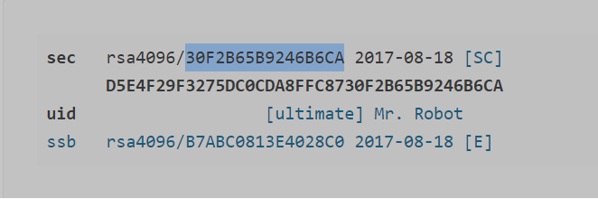

# Chave GPG

A chave GPG é uma das formas de autenticação mais seguras para o GIT. Ela é utilizada para assinar os commits e tags, garantindo a integridade dos dados.

Para gerar uma chave GPG, siga os passos abaixo:

## 1. Gere uma chave GPG

```bash
gpg --full-generate-key
```

## 2. Verifique se a chave foi gerada

```bash
gpg --list-secret-keys --keyid-format LONG <email_configurado_no_passo_1>
```

## 3. Obtenha o ID da chave GPG

No passo anterior, você deve ter obtido um resultado parecido com o abaixo:



Copie o ID da chave GPG, no exemplo acima, o ID é `30F2B65B9246B6CA`.

## 4. Configure o servido GIT remoto para utilizar a chave GPG

Utilize o comando abaixo para gerar uma chave pública GPG:

```bash
gpg --armor --export <id_chave_gpg>
```

E finalmente, copie a chave pública e adicione-a nas configurações do seu perfil no Github/Gitlab.

## 6. Configurando o Git local

Para utilizar a chave GPG no GIT local, execute os comandos abaixo:

```bash
# configuração git
git config --global user.signingkey <id_chave_gpg>
git config --global commit.gpgsign true # assina os commits automaticamente. caso queria fazer manualmente, utilize o comando git commit -S -m "mensagem"
git config --global gpg.program gpg

# configuração shell
echo "export GPG_TTY=$(tty)" >> ~/.bashrc
source ~/.bashrc
```

# Referências

- [Assinando commits no Git com GPG](https://coderi.com.br/2018/01/13/assinando-commits-no-git-com-gpg/)

- [gpg failed to sign the data fatal: failed to write commit object [Git 2.10.0]](https://stackoverflow.com/questions/39494631/gpg-failed-to-sign-the-data-fatal-failed-to-write-commit-object-git-2-10-0)