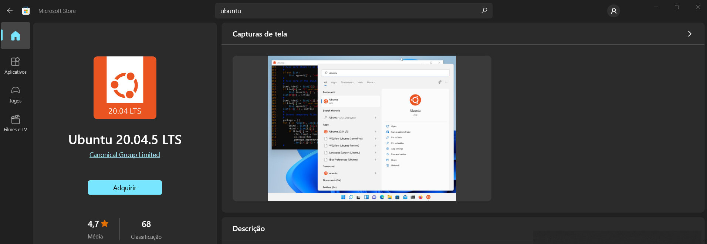

# Instalação do WSL2 para Windows

## O que é o WSL2

Em 2016, a Microsoft anunciou a possibilidade de rodar o Linux dentro do Windows 10 como um subsistema e o nome a isto foi dado de WSL ou Windows Subsystem for Linux.

O acesso ao sistema de arquivos no Windows 10 pelo Linux era simples e rápido, porém não tínhamos uma execução completa do kernel do Linux, além de outros artefatos nativos e isto impossibilitava a execução de várias tarefas no Linux, uma delas é o Docker.

Em 2019, a Microsoft anunciou o WSL 2, com uma dinâmica aprimorada em relação a 1ª versão:

- Execução do kernel completo do Linux.
- **Melhor desempenho para acesso aos arquivos dentro do Linux**.
- Compatibilidade completa de chamada do sistema.

O WSL 2 foi lançado oficialmente no dia 28 de maio de 2020.

Com WSL 2 é possível executar Docker no Linux usando o Windows 10/11.

Compare as versões: https://docs.microsoft.com/pt-br/windows/wsl/compare-versions


## Instalação do WSL2

Antes de tudo, recomendamos instalar o terminal `Windows Terminal` disponível na Windows Store. Ele é um terminal com suporte a várias distribuições Linux e também ao PowerShell e CMD.

### Habilitar o Virtual Machine Platform

Execute os seguintes comandos no PowerShell em modo administrador:
``` bash
dism.exe /online /enable-feature /featurename:Microsoft-Windows-Subsystem-Linux /all /norestart
dism.exe /online /enable-feature /featurename:VirtualMachinePlatform /all /norestart
```
Abra o PowerShell e digite o comando `wsl`, se não funcionar reinicie sua máquina.

### Instalar o executável do WSL

Baixe o Kernel do WSL 2 neste link: [https://docs.microsoft.com/pt-br/windows/wsl/wsl2-kernel](https://docs.microsoft.com/pt-br/windows/wsl/wsl2-kernel) e instale o pacote.


### Atribuir a versão default do WSL para a versão 2

A versão 1 do WSL é a padrão no momento, atribua a versão default para a versão 2, assim todas as distribuições Linux instaladas serão já por default da versão 2. Execute o comando com o PowerShell:

``` bash
wsl --set-default-version 2
```

> # Para Windows 11

Execute o comando:

```bash
wsl --install
```

Este comando irá instalar todas as dependências do WSL instalando o `Ubuntu` como o Linux padrão. 

## Instalar uma distribuição Linux

É possivel instalar distribuições linux diretamente do PowerShell, mas recomendamos instalar pela Microsoft Windows Store. Escolha sua distribuição Linux preferida no aplicativo Windows Store, sugerimos o Ubuntu sem versão, por ser uma versão estável e com várias ferramentas instaladas por padrão.



Ao iniciar o Linux instalado, você deverá criar um **nome de usuário** que poderá ser o mesmo da sua máquina e uma **senha**, este será o usuário **root da sua instância WSL**.

Após a instalação é necessário atualizar o sistema Linux, para isto execute os seguintes comandos:

``` bash
sudo apt update
sudo apt upgrade
```

Parabéns 🎉, seu WSL2 com Linux já está funcionando.

# Dicas com WSL2

## O que o WSL 2 pode usar de recursos da sua máquina

Podemos dizer que o WSL 2 tem acesso quase que total ao recursos de sua máquina. Ele tem acesso por padrão:

* A todo disco rígido.
* A usar completamente os recursos de processamento.
* A usar 80% da memória RAM disponível.
* A usar 25% da memória disponível para SWAP.

Isto pode não ser interessante, uma vez que o WSL 2 pode usar praticamente todos os recursos de sua máquina, mas podemos configurar limites.

Crie um arquivo chamado `.wslconfig` na raiz da sua pasta de usuário `(C:\Users\<seu_usuario>)` e defina estas configurações:

```txt
[wsl2]
memory=8GB
processors=4
swap=2GB
```

Estes são limites de exemplo e as configurações mais básicas a serem utilizadas, configure-os às suas disponibilidades.
Para mais detalhes veja esta documentação da Microsoft: [https://docs.microsoft.com/pt-br/windows/wsl/wsl-config#wsl-2-settings](https://docs.microsoft.com/pt-br/windows/wsl/wsl-config#wsl-2-settings).

Para aplicar estas configurações é necessário reiniciar as distribuições Linux, então sugerimos executar no PowerShell o comando: `wsl --shutdown` (Este comando vai desligar todas as instâncias WSL 2 ativas e basta abrir o terminal novamente para usa-la já com as novas configurações).

## Comandos Úteis

| Comando      | Descrição |
| -----------  | ----------- |
| `wsl --shutdown`  | Desligar distros Linux rodando atualmente |
| `wsl -l -o`  | Listar todas as versões de Linux disponíveis |
| `wsl --install -d nome-da-distribuicao`    | Instalar uma versão do Linux        |


## Referências

- [Guia rápido do WSL2 + Docker (fullcycle)](https://github.com/codeedu/wsl2-docker-quickstart)